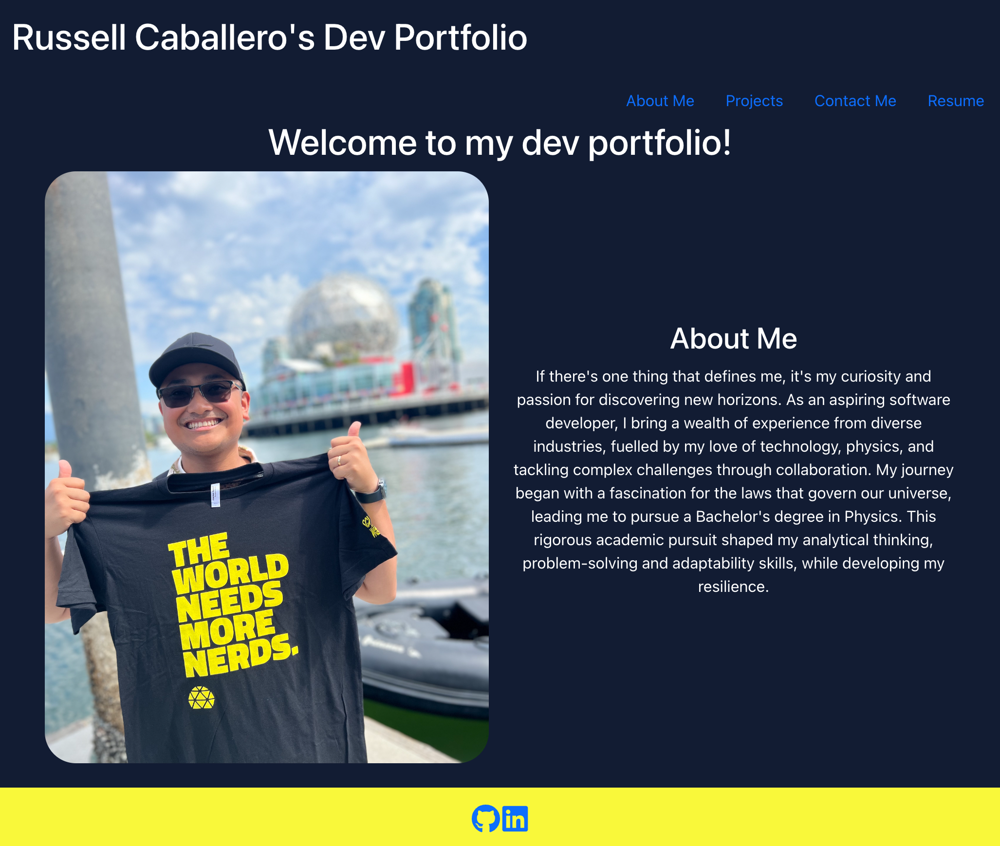

# react-RC-Portfolio

## Table of Contents

- [Description](#description)
- [Resources](#resources)
- [Contributors](#contributors)
- [Questions?](#questions)

## Description
Welcome to my dev portfolio! This portfolio was created using React. 

Deployed Web App: https://caballero-r.github.io/react-RC-Portfolio/

## Resources
1. Original Repo: https://github.com/caballero-r/React-Russell-Portfolio
2. https://react-bootstrap.netlify.app/ 
3. https://getbootstrap.com/
4. https://react-icons.github.io/react-icons/
5. https://www.freecodecamp.org/news/how-to-build-forms-in-react/
6. https://mailtrap.io/blog/validate-emails-in-react/
7. https://formik.org/docs/guides/validation
8. https://www.freecodecamp.org/news/how-to-validate-forms-in-react/

## Contributors
1. caballero-r

## Questions?
If you have any questions or concerns about this application please reach out to [caballero-r](https://github.com/caballero-r) or via email to russellncaballero@gmail.com.

